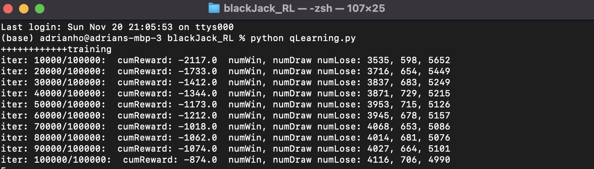
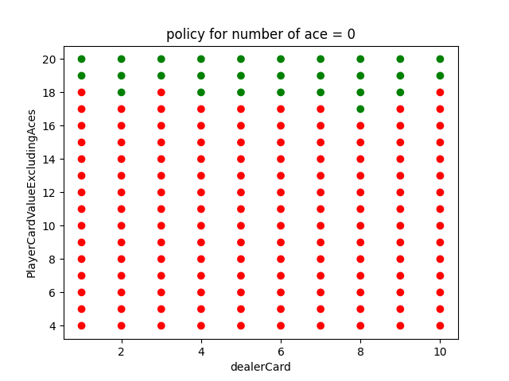
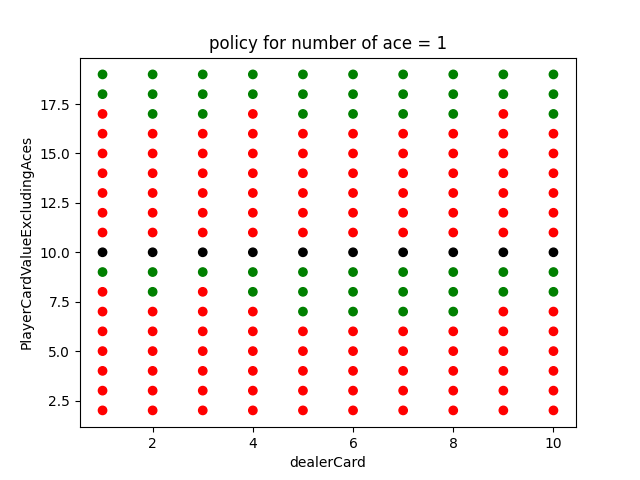

# BlackJack
RL for black jack from scratch. The code uses Q-Learning. The only actions availble are "hit" and "stand" for simplicity.

# Example outputs
The following are outcomes after training for 100000 episodes. In the last 10000 epsiodes, the Q-Learning agent lost 49.9% of the epsidoes. 
The occurence of black jack (getting 21 in the 0th round) is ignored. 

## policy learned:
Note: red means hit, green means stand, black means no actions available

